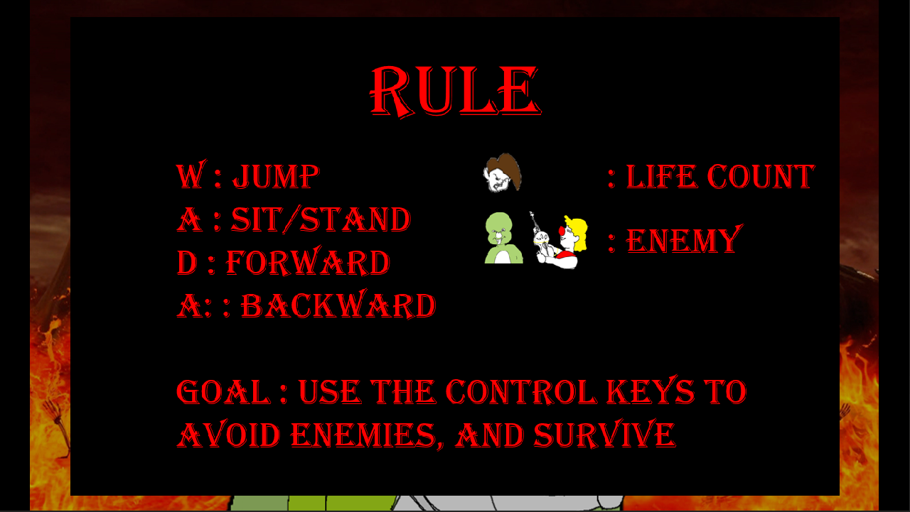
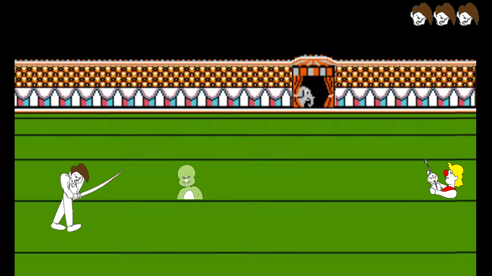
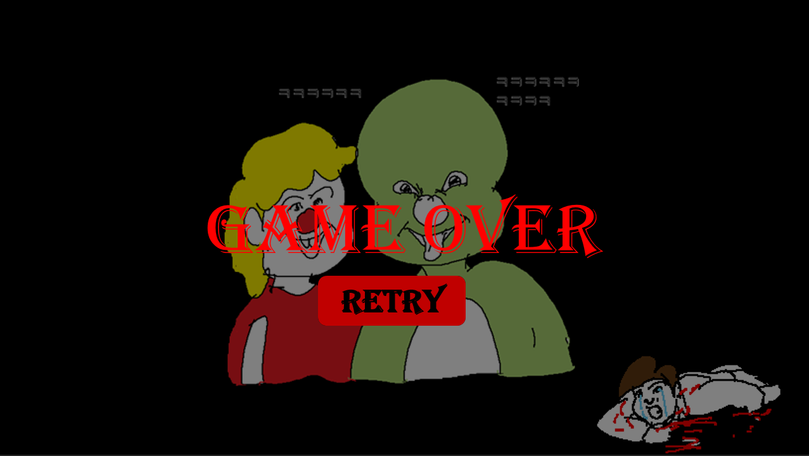

# Gildong, The Warrior Way

[Bangtal Library](https://cafe.naver.com/bangtal)를 활용한 장애물 피하기 게임입니다.


### Youtube Link (Click the image below)

[](https://youtu.be/E8mPpEACvY4)

### How to run app

```bash
$ git clone https://github.com/CAUReturns/circus_game.git
$ cd circus_game
$ pip install virtualenv
$ virtualenv venv
$ venv\Scripts\activate
$ pip install -r requirements.txt
$ python main.py
```

### 게임 규칙

- WASD 키를 활용해 적들을 피해 집까지 도착해야 합니다.
  - W : 점프
  - S : 앉기 / 일어서기
  - A : 뒤로가기 (적들이 느리게 옴)
  - D : 앞으로 가기 (기본 속도)
- 적들과 닿을 때마다 생명력이 1씩 줄어들며, 0이 되면 Game Over 됩니다.
- 스테이지를 클리어할 때마다 적들의 속도와 출현 빈도가 증가합니다.
- 모든 스테이지를 클리어하면 승리합니다.








### Reference

[애기공룡 둘리](https://m.blog.naver.com/undernation/221619500958)
